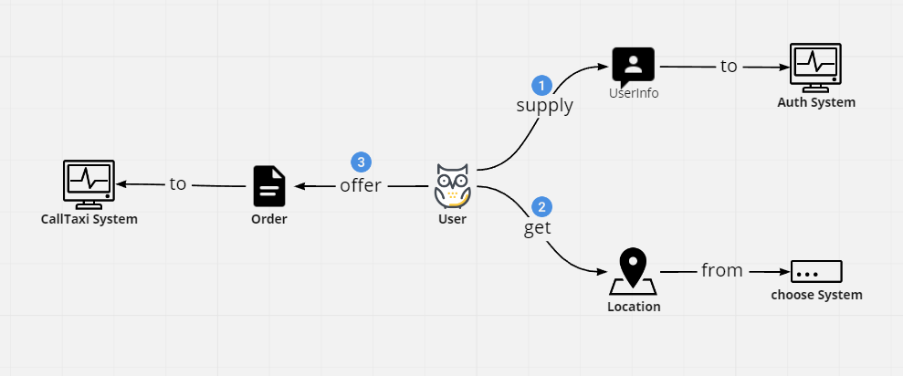
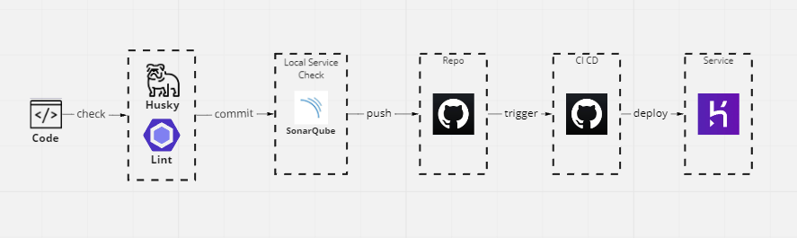

<div id="top"></div>
<div align="center">
  <div align="center" style="width: 50px">


  </div>
  <h3 align="center">Re-Taxi</h3>

  <p align="center">
    <a href="https://taxi-demo-1.herokuapp.com/">heroku demo</a>
    <br />
    <br />
  </p>
</div>

<details open="open">
<summary> 🗻 Table of Contents</summary>

- [About This Project](#about-this-project)
  - [Prerequisites](#prerequisites)
- [Useful Links](#useful-links)
- [My Strategy](#my-strategy)
  - [Another Notice](#another-notice)
- [Usage](#usage)
- [Deploy](#deploy)
- [Project structure](#project-structure)

</details>

## About This Project

Normally, A ride-hailing system will generally cover the following functions, the cost of location selection often conflicts with user experience considerations, so i make an experimental project to optimize efficiency when relying on **google map API**

This project only focus on **No.2** step



### Prerequisites

This project start from **TypeScript** and **React**, and has some base lint rule (eslint and commitlint), so the development may need to pay attention to

## Useful Links

React Router 6
https://reactrouter.com/docs/en/v6/getting-started/tutorial

RTKQ
https://redux-toolkit.js.org/rtk-query/overview

## My Strategy

In my previous work experience, I learned that the most traffic-consuming points were predictive queries and map selection

- I expect to use RTKQ and IndexDB for optimizing the **prediction queries** part.
- The **map selection** part will use a slow trigger strategy

Other areas that could be optimized are the user experience of selecting addresses

#### Another Notice

1.  When dragging the map to select a location, somethings should be noted

    - Normally, we may want to use debounces to save Api traffic
      
    - When the setting is triggered at the end of dragging, this may run into a trap, You can see that there is one more event trigger in the diagram
      
    - You should do the reset timer at the start of the next drag
      

2.  When fetch history data, you may encounter a situation where the default display usually specifies a certain number of orders to be displayed, and the origin and destination information may exist at the same time as the history of orders, so you may have the problem of **not knowing how many orders to take to just meet the demand**.
    - only need 3 order (`/orders?query=3`)
      
    - need 4 order (`/orders?query=4`), but the last order destination is ignored
      
3.  There is one of user action you should be noted, in this situation, The user may take the following four actions (Let's ignore the possibility that it will just close and go away)
    - **Press the previous button**, but the input text `taipei macdona` is need to be handle, In this project, it will revert to the previous input state
    - **Continue entering text**, normal operation
    - **Click on the address element**, normal operation
    - **Press the map select button**, but the input text `taipei macdona` is need to be handle, In this project, it will use the first prediction as input and move the map center to the location
      
4.  In handling user input predictions, we want the predicted value to be as close as possible to the value in the user's mind, so that we can avoid costly redundant operations by the user, and therefore need to pay more attention to the `bound` value

## Usage

After you have cloned, there are a few things you must do

- Add local env `.env.local` to place your **google map key**

```json
REACT_APP_GOOGLE_KEY="YOUR_KEY"
```

- Install the dependencies

```bash
yarn
```

- Start this project

```bash
yarn run start
```

- If you just want to see the UI, you can find him through **storybook** (not yet 😂)

```bash
yarn run storybook
```

- `.env` file has some function trigger to try a different user experience

## Deploy

To make my work easier and to ensure the quality of the code, I have designed some processes for this project

- Because I can't find a space where I can deploy Sonarqube without spending money, so I set up a local docker and provided the code scanning service to myself

- Because heroku instance PORT is random, so I did some work on the dockerFile and nginx config files, those are not proper usage



## Project structure

My folder structure is separated by feature, as the project is still small, so I want to avoid over-design.

```shell
Project
├─ .asset                                   #  docs asset
├─ .husky                                   #  husky config folder (lint check before commit)
├─ .vscode                                  #  vscode config folder (extension convenience)
├─ public
│  ├─ mainifest.json                        #  I will add PWA feature after refactor
│  └─ index.html
├─ src
│  ├─ feature                               #  core Logic Components
│  ├─ layout                                #  UI that is not part of the main program
│  ├─ router                                #  the act of splitting the router
│  ├─ store                                 #  RTK slice
│  ├─ stories                               #  storybook component stories (not yet 😂)
│  └─ ...
└─ ...
```
